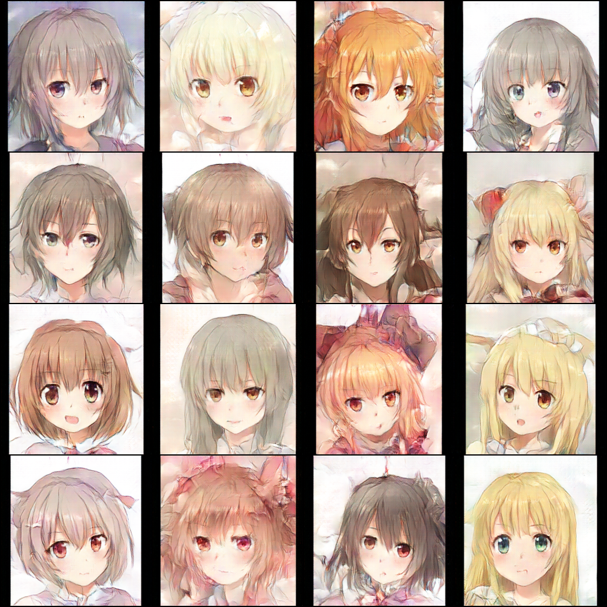

# DCGAN on Anime Faces Dataset

Convolutional Neural Networks(CNNs) are powerful in image processing tasks. Deep Convolutional Neural Networks(DCGAN) introduces convolution layers in GAN(both in Generator and Discriminator). This simple improvement significantly increases the quality of the generated images. In this work I trained a DCGAN to generate images of size 256×256 based on an anime faces dataset. You can see the effect of the generated images below.



## How to Run

### 1. Download the dataset

The anime faces dataset I used is on Kaggle. It is clean dataset, contains 25K anime faces of size 512×512. All images are clear, high-quality, and consistent in style.

This anime faces dataset is free, but not completely public. You need to download it by yourself. Here I'll provide a guide on how to download it.

#### 1.1 Get a Kaggle Account

Firstly, you need an account for [Kaggle](https://www.kaggle.com/). If you've already had one, jump to part1.2. Otherwise,  sign up for an account first.

#### 1.2 Download the Anime Faces Dataset

The dataset is in this page [Anime GAN Lite](https://www.kaggle.com/datasets/prasoonkottarathil/gananime-lite). Download the zip to the path `data/`. If succeed, you may see a file `archive.zip` in the path `data/`

Then let‘s unzip the dataset. Just run the command below:

```bash
cd data
unzip archive.zip
```

If all of above are successfully done, you'll see files structured like this:

```
.
├── src/                  # Source code
│   ├── models.py         # Generator and Discriminator classes
│   ├── trainer.py        # Trainer class with the training loop
│   ├── dataset.py        # The dataloader
│   ├── utils/            # Helper functions (e.g., logger)
│   │   ├──logger.py      # Setup logger
│   └── main.py           # Main script to run the training
│   data/
│   ├── archive.zip
│   ├── out2/              # Anime faces dataset
│   │   ├── seed1000.png
│   │   ├── seed1001.png
│   │   ├── ...
├── results/              # Output folder for generated images
├── config.yaml           # All hyperparameters and paths
├── requirements.txt      # Python dependencies
└── README.md             # This file
```

That means the dataset has been successfully downloaded.

#### 1.3 Addition: Downloading the Dataset to another location

If you need to place the dataset in somewhere else, you can change the data path in the file `config.yaml`

You may see `config.yaml` has contents like this:

```yaml
# Train parameters
project_name : "DCGAN_AnimeFaces"
num_epochs : 400
batch_size : 64
lr : 0.00003
beta1 : 0.5
beta2 : 0.999
k : 1               # number of discriminator updates per generator update
log_interval : 10   
# Model parameters
latent_dim : 32
img_shape : [256, 256]
channels : 3
# Paths
data_dir : "data/out2"
output_dir : "../results"
```

Change the value of the parameter `data_dir`  **directly to** where your `.png` files are. 

For example, If you want your files structured like this:

```
.
├── 02_DCGAN_AnimeFaces
│   ├── src/                  
│   │   ├── models.py        
│   │   ├── trainer.py       
│   │   ...
│   ├── results/              
│   ├── config.yaml           # All hyperparameters and paths
│   ...
├── data/
│   ├── out2/
│   │   ├── seed1000.png
│   │   ├── seed1001.png
│   │   ├──...

```

You can set the value of parameter `data_dir` like this:

```yaml
data_dir : "../data/out2"
```

### 2.Run the training progress

This part is very similar to the project `01_simple_GAN_MNIST` 

**2.1 Create a Virtual Environment (Recommended) **

```bash
# For Linux/macOS
python3 -m venv venv
source venv/bin/activate

# For Windows
python -m venv venv
venv\Scripts\activate
```

**2.2 Install Dependencies**

```bash
pip install -r requirements.txt
```

**2.3 Start Training** 

Run the main training script. 

```bash
python main.py
```

**2.4 Check the Results**

During training, sample images generated by the GAN will be saved periodically to the `result/fake_images/` directory. You can monitor this folder to see how the Generator improves over time.

This will take 8~12 hours on a RTX4090，and after that you can see the generated images like I showed.

---

## Tricks to Avoid Mode Collapse

Mode collapse frequently occurs when training GANs. Here are some tricks to reduce the likelihood of mode collapse.

1. **Use `BatchNorm` in Generator.** Otherwise mode collapse is almost inevitable.

2. **Non-saturating Generator Loss.** The original paper used the saturating loss ( $\log(1 - D(G(z)))$ ). Nowadays, the non-saturating loss,  minimizing $-\log(D(G(z)))$, is more commonly adopted due to its more stable gradients.

3. **Use `nn.BCELoss` or `nn.BCEWithLogitsLoss` instead of `torch.log`.**  

4. **For the Adam optimizer, the parameter $\beta_1$ is typically set smaller than its default value, often chosen as 0.5.**

   
